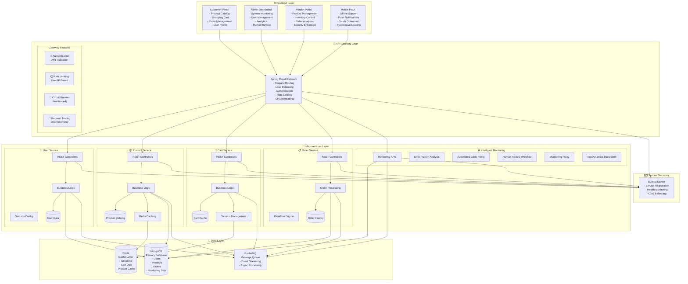
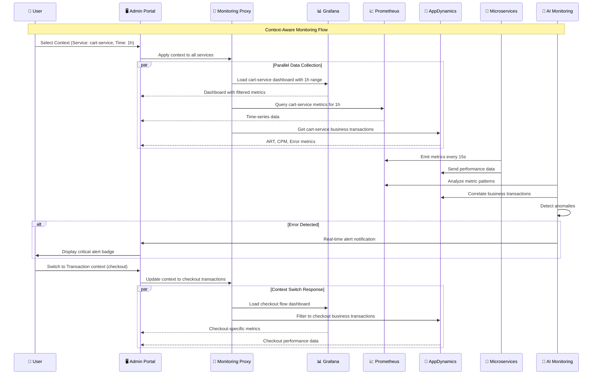

# E-Commerce Microservices Architecture with Unified Monitoring

## System Architecture Overview

```mermaid
graph TB
    %% External Users
    Customer[👤 Customer Users]
    Admin[👨‍💼 Admin Users]
    Vendor[🏪 Vendor Users]
    Mobile[📱 Mobile Users]

    %% Load Balancer & Reverse Proxy
    LB[🔄 Load Balancer<br/>nginx/HAProxy]
    
    %% Apache Multi-Portal Gateway
    Apache[🌐 Apache HTTP Server<br/>Multi-Virtual-Host]
    
    %% Frontend Portals
    CustomerPortal[🛒 Customer Portal<br/>Angular 17+<br/>shop.ecommerce.com]
    AdminPortal[⚙️ Admin Dashboard<br/>Angular 17+<br/>admin.ecommerce.com]
    VendorPortal[📊 Vendor Portal<br/>Angular 17+<br/>vendor.ecommerce.com]
    MobilePortal[📱 Mobile PWA<br/>Angular 17+<br/>m.ecommerce.com]

    %% API Gateway
    Gateway[🚪 API Gateway<br/>Spring Cloud Gateway<br/>Port: 8080]

    %% Core Microservices
    UserService[👤 User Service<br/>Spring Boot<br/>Port: 8081]
    ProductService[📦 Product Service<br/>Spring Boot<br/>Port: 8082]
    CartService[🛒 Cart Service<br/>Spring Boot<br/>Port: 8083]
    OrderService[📋 Order Service<br/>Spring Boot<br/>Port: 8084]
    
    %% Monitoring & Intelligence
    MonitoringService[🔍 Intelligent Monitoring<br/>Spring Boot<br/>Port: 8090]
    
    %% Service Discovery
    Eureka[🗺️ Eureka Server<br/>Service Discovery<br/>Port: 8761]

    %% Databases
    MongoDB[🍃 MongoDB<br/>Primary Database<br/>Port: 27017]
    Redis[🔴 Redis Cache<br/>Session & Cart<br/>Port: 6379]

    %% Message Queue
    RabbitMQ[🐰 RabbitMQ<br/>Event Bus<br/>Port: 5672]

    %% Monitoring Stack
    subgraph "📊 Monitoring & Observability Stack"
        direction TB
        
        %% Metrics Collection
        Prometheus[📈 Prometheus<br/>Metrics Collection<br/>Port: 9090]
        
        %% Visualization
        Grafana[📊 Grafana<br/>Dashboards & Visualization<br/>Port: 3000]
        
        %% Alerting
        AlertManager[🚨 AlertManager<br/>Alert Management<br/>Port: 9093]
        
        %% Distributed Tracing
        Tempo[🔗 Tempo<br/>Distributed Tracing<br/>Port: 3200]
        Jaeger[👁️ Jaeger<br/>Trace UI<br/>Port: 16686]
        
        %% Log Management
        ElasticSearch[🔍 ElasticSearch<br/>Log Storage<br/>Port: 9200]
        Logstash[📝 Logstash<br/>Log Processing<br/>Port: 5044]
        Kibana[📋 Kibana<br/>Log Visualization<br/>Port: 5601]
        Filebeat[📄 Filebeat<br/>Log Shipping]
        
        %% OpenTelemetry
        OtelCollector[📡 OpenTelemetry Collector<br/>Telemetry Gateway<br/>Port: 4317]
    end

    %% External Monitoring
    AppDynamics[🎯 AppDynamics<br/>APM Platform<br/>SaaS]

    %% Load Testing
    LoadGen[⚡ Load Generator<br/>Python/Locust<br/>Realistic Traffic]

    %% Connections - User Traffic Flow
    Customer --> LB
    Admin --> LB
    Vendor --> LB
    Mobile --> LB
    
    LB --> Apache
    
    Apache --> CustomerPortal
    Apache --> AdminPortal
    Apache --> VendorPortal
    Apache --> MobilePortal

    %% Frontend to API Gateway
    CustomerPortal --> Gateway
    AdminPortal --> Gateway
    VendorPortal --> Gateway
    MobilePortal --> Gateway

    %% API Gateway to Services
    Gateway --> UserService
    Gateway --> ProductService
    Gateway --> CartService
    Gateway --> OrderService
    Gateway --> MonitoringService

    %% Service Discovery
    Gateway --> Eureka
    UserService --> Eureka
    ProductService --> Eureka
    CartService --> Eureka
    OrderService --> Eureka
    MonitoringService --> Eureka

    %% Database Connections
    UserService --> MongoDB
    ProductService --> MongoDB
    CartService --> MongoDB
    CartService --> Redis
    OrderService --> MongoDB
    MonitoringService --> MongoDB

    %% Message Queue
    UserService --> RabbitMQ
    ProductService --> RabbitMQ
    CartService --> RabbitMQ
    OrderService --> RabbitMQ
    MonitoringService --> RabbitMQ

    %% Monitoring Integrations
    MonitoringService --> Prometheus
    MonitoringService --> Grafana
    MonitoringService --> AlertManager
    MonitoringService --> Tempo
    MonitoringService --> ElasticSearch
    MonitoringService --> AppDynamics
    MonitoringService --> OtelCollector

    %% OpenTelemetry Flow
    Gateway --> OtelCollector
    UserService --> OtelCollector
    ProductService --> OtelCollector
    CartService --> OtelCollector
    OrderService --> OtelCollector
    OtelCollector --> Tempo
    OtelCollector --> Prometheus

    %% Logging Flow
    Gateway --> Filebeat
    UserService --> Filebeat
    ProductService --> Filebeat
    CartService --> Filebeat
    OrderService --> Filebeat
    MonitoringService --> Filebeat
    Filebeat --> Logstash
    Logstash --> ElasticSearch
    ElasticSearch --> Kibana

    %% Monitoring Stack Internal
    Prometheus --> Grafana
    Prometheus --> AlertManager
    AlertManager --> Grafana
    Tempo --> Grafana
    Tempo --> Jaeger

    %% Load Testing
    LoadGen --> LB

    %% Admin Portal Monitoring Access
    AdminPortal -.-> Grafana
    AdminPortal -.-> Prometheus
    AdminPortal -.-> AlertManager
    AdminPortal -.-> Kibana
    AdminPortal -.-> Jaeger
    AdminPortal -.-> AppDynamics

    %% Styling
    classDef frontend fill:#e1f5fe,stroke:#01579b,stroke-width:2px
    classDef microservice fill:#f3e5f5,stroke:#4a148c,stroke-width:2px
    classDef database fill:#e8f5e8,stroke:#1b5e20,stroke-width:2px
    classDef monitoring fill:#fff3e0,stroke:#e65100,stroke-width:2px
    classDef infrastructure fill:#fce4ec,stroke:#880e4f,stroke-width:2px
    classDef external fill:#f1f8e9,stroke:#33691e,stroke-width:2px

    class CustomerPortal,AdminPortal,VendorPortal,MobilePortal frontend
    class Gateway,UserService,ProductService,CartService,OrderService,MonitoringService microservice
    class MongoDB,Redis,RabbitMQ database
    class Prometheus,Grafana,AlertManager,Tempo,Jaeger,ElasticSearch,Logstash,Kibana,OtelCollector monitoring
    class LB,Apache,Eureka,LoadGen infrastructure
    class AppDynamics external
```

## Detailed Component Architecture

## Monitoring Integration Architecture

```mermaid
graph TB
    subgraph "🔍 Unified Monitoring Portal"
        direction TB
        Portal[Admin Dashboard<br/>Unified Monitoring Interface]
        
        subgraph "Context Management"
            GlobalCtx[Global Context<br/>- Scope Selection<br/>- Time Range<br/>- Environment<br/>- Filters]
            
            subgraph "Context Types"
                ScopeGlobal[🌍 Global Overview]
                ScopeService[🔧 Service Focus]
                ScopeUser[👤 User Journey]
                ScopeTx[💳 Transaction Analysis]
                ScopeInfra[🏗️ Infrastructure]
            end
        end
        
        subgraph "Monitoring Tabs"
            GrafanaTab[📊 Grafana Dashboards]
            PrometheusTab[📈 Prometheus Metrics]
            AlertTab[🚨 AlertManager]
            TraceTab[🔗 Tempo Tracing]
            LogTab[📝 Log Analysis]
            AppDTab[🎯 AppDynamics Metrics]
        end
    end

    subgraph "📊 Metrics Collection & Storage"
        direction TB
        
        subgraph "Application Metrics"
            AppMetrics[Application Metrics<br/>- Request Count<br/>- Response Time<br/>- Error Rate<br/>- JVM Metrics]
            
            BusinessMetrics[Business Metrics<br/>- User Registrations<br/>- Orders Placed<br/>- Revenue<br/>- Cart Abandonment]
            
            CustomMetrics[Custom Metrics<br/>- Feature Usage<br/>- A/B Test Results<br/>- Performance KPIs]
        end
        
        PrometheusServer[Prometheus Server<br/>- Metric Scraping<br/>- Time Series DB<br/>- Query Engine<br/>- Alerting Rules]
        
        subgraph "Dashboards"
            SystemDash[System Overview<br/>- Health Status<br/>- Resource Usage<br/>- Error Rates]
            
            ServiceDash[Service Dashboards<br/>- Per-Service Metrics<br/>- Dependencies<br/>- SLA Tracking]
            
            BusinessDash[Business Dashboards<br/>- Revenue Metrics<br/>- User Analytics<br/>- Performance KPIs]
        end
        
        GrafanaServer[Grafana Server<br/>- Visualization<br/>- Alerting<br/>- Dashboard Management]
    end

    subgraph "🚨 Alerting & Notification"
        direction TB
        
        AlertManagerServer[AlertManager<br/>- Alert Routing<br/>- Notification Management<br/>- Silence Handling]
        
        subgraph "Alert Types"
            SystemAlerts[System Alerts<br/>- Service Down<br/>- High CPU/Memory<br/>- Disk Space]
            
            AppAlerts[Application Alerts<br/>- High Error Rate<br/>- Slow Response<br/>- Failed Deployments]
            
            BusinessAlerts[Business Alerts<br/>- Revenue Drop<br/>- High Cart Abandonment<br/>- User Churn]
        end
        
        subgraph "Notification Channels"
            Email[📧 Email Notifications]
            Slack[💬 Slack Integration]
            PagerDuty[📟 PagerDuty]
            WebHooks[🔗 Custom WebHooks]
        end
    end

    subgraph "🔗 Distributed Tracing"
        direction TB
        
        OTelCollector[OpenTelemetry Collector<br/>- Trace Collection<br/>- Span Processing<br/>- Export Pipeline]
        
        TempoServer[Tempo Backend<br/>- Trace Storage<br/>- Query Interface<br/>- Retention Management]
        
        JaegerUI[Jaeger UI<br/>- Trace Visualization<br/>- Service Map<br/>- Performance Analysis]
        
        subgraph "Trace Types"
            UserTraces[User Journey Traces<br/>- End-to-End Flows<br/>- User Actions<br/>- Performance Impact]
            
            ServiceTraces[Service Traces<br/>- Inter-Service Calls<br/>- Database Queries<br/>- External APIs]
            
            ErrorTraces[Error Traces<br/>- Exception Tracking<br/>- Failure Analysis<br/>- Root Cause]
        end
    end

    subgraph "📝 Centralized Logging"
        direction TB
        
        LogShippers[Log Shippers<br/>Filebeat Agents]
        
        LogstashServer[Logstash<br/>- Log Processing<br/>- Parsing & Filtering<br/>- Enrichment]
        
        ElasticSearchCluster[ElasticSearch Cluster<br/>- Log Storage<br/>- Full-Text Search<br/>- Aggregations]
        
        KibanaServer[Kibana<br/>- Log Visualization<br/>- Search Interface<br/>- Dashboard Creation]
        
        subgraph "Log Types"
            AppLogs[Application Logs<br/>- Business Logic<br/>- Error Messages<br/>- Debug Info]
            
            AccessLogs[Access Logs<br/>- HTTP Requests<br/>- Response Codes<br/>- User Actions]
            
            SystemLogs[System Logs<br/>- Infrastructure<br/>- Security Events<br/>- Performance]
        end
    end

    subgraph "🎯 AppDynamics Integration"
        direction TB
        
        AppDController[AppDynamics Controller<br/>SaaS Platform]
        
        AppDAgent[AppD Java Agents<br/>- Auto-Instrumentation<br/>- Business Transactions<br/>- Code-Level Visibility]
        
        subgraph "AppD Metrics"
            ARTMetrics[ART - Average Response Time<br/>- Real-time Performance<br/>- Trending Analysis<br/>- SLA Tracking]
            
            CPMMetrics[CPM - Calls Per Minute<br/>- Throughput Analysis<br/>- Capacity Planning<br/>- Load Patterns]
            
            ErrorMetrics[Error Analysis<br/>- Error Rate %<br/>- Exception Details<br/>- Error Snapshots]
            
            ApdexMetrics[Apdex Score<br/>- User Experience<br/>- Satisfaction Index<br/>- Performance Goals]
        end
        
        subgraph "Business Transactions"
            LoginTx[User Login Flow]
            CheckoutTx[Checkout Process]
            BrowseTx[Product Browsing]
            SearchTx[Product Search]
        end
    end

    subgraph "🔍 Intelligent Monitoring Service"
        direction TB
        
        ErrorAnalysis[Error Pattern Analysis<br/>- ML-based Detection<br/>- Pattern Recognition<br/>- Trend Analysis]
        
        AutoFixing[Automated Code Fixing<br/>- Pattern-based Fixes<br/>- Test Generation<br/>- Confidence Scoring]
        
        HumanReviewSys[Human Review System<br/>- Review Workflow<br/>- Approval Process<br/>- Audit Trail]
        
        CrossPlatform[Cross-Platform Correlation<br/>- Multi-source Data<br/>- Event Correlation<br/>- Impact Analysis]
        
        ProxyService[Monitoring Proxy<br/>- Unified API<br/>- Authentication<br/>- Context Routing]
    end

    %% Data Flow Connections
    
    %% Application to Monitoring
    subgraph "Applications" 
        Gateway
        UserService
        ProductService  
        CartService
        OrderService
    end
    
    %% Metrics Flow
    Applications --> AppMetrics
    Applications --> BusinessMetrics
    Applications --> CustomMetrics
    AppMetrics --> PrometheusServer
    BusinessMetrics --> PrometheusServer
    CustomMetrics --> PrometheusServer
    PrometheusServer --> GrafanaServer
    PrometheusServer --> AlertManagerServer
    
    %% Tracing Flow
    Applications --> OTelCollector
    OTelCollector --> TempoServer
    TempoServer --> JaegerUI
    TempoServer --> GrafanaServer
    
    %% Logging Flow
    Applications --> LogShippers
    LogShippers --> LogstashServer
    LogstashServer --> ElasticSearchCluster
    ElasticSearchCluster --> KibanaServer
    
    %% AppDynamics Flow
    Applications --> AppDAgent
    AppDAgent --> AppDController
    AppDController --> ARTMetrics
    AppDController --> CPMMetrics
    AppDController --> ErrorMetrics
    AppDController --> ApdexMetrics
    
    %% Intelligent Monitoring
    PrometheusServer --> ErrorAnalysis
    ElasticSearchCluster --> ErrorAnalysis
    AppDController --> ErrorAnalysis
    ErrorAnalysis --> AutoFixing
    AutoFixing --> HumanReviewSys
    
    %% Unified Portal Integration
    Portal --> ProxyService
    ProxyService --> GrafanaServer
    ProxyService --> PrometheusServer
    ProxyService --> AlertManagerServer
    ProxyService --> TempoServer
    ProxyService --> KibanaServer
    ProxyService --> AppDController
    
    %% Context-aware routing
    GlobalCtx --> ProxyService
    ScopeGlobal --> GrafanaTab
    ScopeService --> GrafanaTab
    ScopeUser --> TraceTab
    ScopeTx --> AppDTab
    ScopeInfra --> PrometheusTab
    
    %% Alert Notifications
    AlertManagerServer --> Email
    AlertManagerServer --> Slack
    AlertManagerServer --> PagerDuty
    AlertManagerServer --> WebHooks
    
    %% Cross-platform correlation
    PrometheusServer --> CrossPlatform
    TempoServer --> CrossPlatform
    ElasticSearchCluster --> CrossPlatform
    AppDController --> CrossPlatform
    CrossPlatform --> ErrorAnalysis

    %% Styling
    classDef frontend fill:#e1f5fe,stroke:#01579b,stroke-width:2px
    classDef monitoring fill:#fff3e0,stroke:#e65100,stroke-width:2px
    classDef intelligence fill:#f3e5f5,stroke:#4a148c,stroke-width:2px
    classDef external fill:#f1f8e9,stroke:#33691e,stroke-width:2px
    classDef data fill:#e8f5e8,stroke:#1b5e20,stroke-width:2px

    class Portal,GrafanaTab,PrometheusTab,AlertTab,TraceTab,LogTab,AppDTab frontend
    class PrometheusServer,GrafanaServer,AlertManagerServer,TempoServer,JaegerUI,LogstashServer,ElasticSearchCluster,KibanaServer monitoring
    class ErrorAnalysis,AutoFixing,HumanReviewSys,CrossPlatform,ProxyService intelligence
    class AppDController,AppDAgent external
    class AppMetrics,BusinessMetrics,CustomMetrics,UserTraces,ServiceTraces,ErrorTraces data
```

## Monitoring Data Flow

## Component Monitoring Matrix

| Component | Metrics Collection | Log Aggregation | Distributed Tracing | APM Integration | Health Checks |
|-----------|-------------------|-----------------|-------------------|-----------------|---------------|
| **API Gateway** | ✅ Prometheus | ✅ ELK Stack | ✅ OpenTelemetry | ✅ AppDynamics | ✅ Spring Actuator |
| **User Service** | ✅ Prometheus | ✅ ELK Stack | ✅ OpenTelemetry | ✅ AppDynamics | ✅ Spring Actuator |
| **Product Service** | ✅ Prometheus | ✅ ELK Stack | ✅ OpenTelemetry | ✅ AppDynamics | ✅ Spring Actuator |
| **Cart Service** | ✅ Prometheus | ✅ ELK Stack | ✅ OpenTelemetry | ✅ AppDynamics | ✅ Spring Actuator |
| **Order Service** | ✅ Prometheus | ✅ ELK Stack | ✅ OpenTelemetry | ✅ AppDynamics | ✅ Spring Actuator |
| **Monitoring Service** | ✅ Prometheus | ✅ ELK Stack | ✅ OpenTelemetry | ❌ Self-monitoring | ✅ Spring Actuator |
| **Customer Portal** | ✅ Browser Metrics | ✅ Frontend Logs | ✅ User Sessions | ✅ Real User Monitoring | ✅ Uptime Monitoring |
| **Admin Portal** | ✅ Browser Metrics | ✅ Frontend Logs | ✅ User Sessions | ✅ Real User Monitoring | ✅ Uptime Monitoring |
| **Vendor Portal** | ✅ Browser Metrics | ✅ Frontend Logs | ✅ User Sessions | ✅ Real User Monitoring | ✅ Uptime Monitoring |
| **Mobile PWA** | ✅ Browser Metrics | ✅ Frontend Logs | ✅ User Sessions | ✅ Real User Monitoring | ✅ Uptime Monitoring |
| **MongoDB** | ✅ MongoDB Exporter | ✅ MongoDB Logs | ❌ N/A | ✅ Database Monitoring | ✅ Connection Health |
| **Redis** | ✅ Redis Exporter | ✅ Redis Logs | ❌ N/A | ✅ Cache Monitoring | ✅ Connection Health |
| **RabbitMQ** | ✅ RabbitMQ Exporter | ✅ RabbitMQ Logs | ❌ N/A | ✅ Message Queue Monitoring | ✅ Queue Health |
| **Apache Server** | ✅ Apache Exporter | ✅ Access/Error Logs | ✅ Request Tracing | ✅ Web Server Monitoring | ✅ HTTP Health Checks |
| **Eureka Server** | ✅ Prometheus | ✅ ELK Stack | ✅ OpenTelemetry | ❌ Internal Service | ✅ Spring Actuator |

## Key Monitoring Features

### 🎯 **Unified Context Management**
- **Single Context**: Set once, applies to all monitoring tools
- **Smart Routing**: Automatic service-specific dashboard selection
- **Time Synchronization**: Consistent time ranges across all tools
- **Filter Propagation**: Context filters applied to metrics, logs, and traces

### 📊 **Real-Time Dashboards**
- **System Overview**: High-level health and performance metrics
- **Service-Specific**: Detailed per-service monitoring
- **Business Metrics**: Revenue, user engagement, conversion rates
- **Infrastructure**: Resource utilization, capacity planning

### 🚨 **Intelligent Alerting**
- **Multi-Source Correlation**: Alerts from metrics, logs, and APM
- **Context-Aware Routing**: Alerts routed based on service ownership
- **Escalation Policies**: Automated escalation for critical issues
- **Alert Suppression**: Intelligent grouping to reduce noise

### 🔗 **Distributed Tracing**
- **End-to-End Visibility**: Complete request journey tracking
- **Performance Bottlenecks**: Identify slow components
- **Error Root Cause**: Trace errors to source
- **User Journey Mapping**: Track user interactions across services

### 🧠 **AI-Powered Monitoring**
- **Anomaly Detection**: ML-based pattern recognition
- **Predictive Alerting**: Proactive issue identification
- **Automated Root Cause**: AI-driven problem analysis
- **Self-Healing**: Automated code fixes with human oversight

### 📈 **Performance Analytics**
- **SLA Tracking**: Service level agreement monitoring
- **Capacity Planning**: Resource usage trends and forecasting
- **Business Impact**: Correlation between technical and business metrics
- **User Experience**: Real user monitoring and synthetic transactions

This comprehensive monitoring architecture provides end-to-end visibility, intelligent automation, and unified management of the entire e-commerce microservices platform.