# Enterprise E-Commerce Platform - Executive Summary Flow Diagram

## System Integration & Data Flow Overview

```mermaid
graph TB
    %% User Interface Layer
    subgraph "👥 User Access Layer"
        Customer[👤 Customer Users]
        Admin[👨‍💼 Admin Users]
        Vendor[🏪 Vendor Users]
        Mobile[📱 Mobile Users]
    end

    %% Frontend Layer
    subgraph "🌐 Multi-Portal Frontend Layer"
        Apache[🌐 Apache HTTP Server<br/>Multi-Virtual-Host Gateway]
        CustomerPortal[🛒 Customer Portal<br/>shop.ecommerce.com]
        AdminPortal[⚙️ Admin Dashboard<br/>admin.ecommerce.com<br/>+ Unified Monitoring]
        VendorPortal[📊 Vendor Portal<br/>vendor.ecommerce.com]
        MobilePortal[📱 Mobile PWA<br/>m.ecommerce.com]
    end

    %% API Gateway & Load Balancing
    subgraph "🚪 API Gateway & Routing"
        LoadBalancer[🔄 Load Balancer]
        APIGateway[🚪 Spring Cloud Gateway<br/>• Authentication<br/>• Rate Limiting<br/>• Circuit Breaking]
    end

    %% Core Business Services
    subgraph "🔧 Core Microservices"
        UserService[👤 User Service<br/>Port: 8082]
        ProductService[📦 Product Service<br/>Port: 8083]
        CartService[🛒 Cart Service<br/>Port: 8084]
        OrderService[📋 Order Service<br/>Port: 8085]
    end

    %% Intelligent Monitoring & AI
    subgraph "🧠 Intelligent Monitoring & AI"
        MonitoringService[🔍 Intelligent Monitoring Service<br/>Port: 8090<br/>• AI Error Detection<br/>• Automated Code Fixing<br/>• Human Review Workflow]
        
        subgraph "AI Features"
            ErrorAnalysis[🧠 ML Error Pattern Detection]
            AutoFix[🤖 Automated Code Fixing]
            HumanReview[👥 Human-in-the-Loop Review]
            CrossCorrelation[🔗 Cross-Platform Correlation]
        end
    end

    %% Data Storage Layer
    subgraph "💾 Data Storage Layer"
        MongoDB[🍃 MongoDB<br/>Primary Database<br/>Port: 27017]
        Redis[🔴 Redis Cache<br/>Session & Cart Data<br/>Port: 6379]
        MessageQueue[🐰 RabbitMQ<br/>Event Bus<br/>Port: 5672]
    end

    %% Service Discovery
    subgraph "🗺️ Service Discovery"
        Eureka[🗺️ Eureka Server<br/>Service Registry<br/>Port: 8761]
    end

    %% Monitoring & Observability Stack
    subgraph "📊 Unified Monitoring Stack"
        direction TB
        
        subgraph "Metrics & Visualization"
            Prometheus[📈 Prometheus<br/>Metrics Collection<br/>Port: 9090]
            Grafana[📊 Grafana<br/>Dashboards<br/>Port: 3000]
            AlertManager[🚨 AlertManager<br/>Intelligent Alerting]
        end
        
        subgraph "Distributed Tracing"
            OtelCollector[📡 OpenTelemetry Collector<br/>Telemetry Gateway<br/>Port: 4317]
            Tempo[🔗 Tempo<br/>Trace Storage<br/>Port: 3200]
            Jaeger[👁️ Jaeger UI<br/>Trace Visualization<br/>Port: 16686]
        end
        
        subgraph "Log Management"
            ElasticSearch[🔍 ElasticSearch<br/>Log Storage]
            Logstash[📝 Logstash<br/>Log Processing]
            Kibana[📋 Kibana<br/>Log Analysis]
        end
    end

    %% External APM
    subgraph "🎯 External APM"
        AppDynamics[🎯 AppDynamics SaaS<br/>• OAuth2 Authentication<br/>• ART Metrics<br/>• CPM Analysis<br/>• Error Tracking<br/>• Business Transactions]
    end

    %% Load Testing
    subgraph "⚡ Load Testing & Simulation"
        LoadGenerator[⚡ Load Generator<br/>• Realistic User Journeys<br/>• 30-min Load Test<br/>• Multiple User Patterns]
    end

    %% User Flow
    Customer --> LoadBalancer
    Admin --> LoadBalancer
    Vendor --> LoadBalancer
    Mobile --> LoadBalancer
    
    LoadBalancer --> Apache
    
    Apache --> CustomerPortal
    Apache --> AdminPortal
    Apache --> VendorPortal
    Apache --> MobilePortal

    %% API Gateway Flow
    CustomerPortal --> APIGateway
    AdminPortal --> APIGateway
    VendorPortal --> APIGateway
    MobilePortal --> APIGateway

    %% Service Communication
    APIGateway --> UserService
    APIGateway --> ProductService
    APIGateway --> CartService
    APIGateway --> OrderService
    APIGateway --> MonitoringService

    %% Service Registry
    APIGateway --> Eureka
    UserService --> Eureka
    ProductService --> Eureka
    CartService --> Eureka
    OrderService --> Eureka
    MonitoringService --> Eureka

    %% Database Connections
    UserService --> MongoDB
    ProductService --> MongoDB
    CartService --> MongoDB
    CartService --> Redis
    OrderService --> MongoDB
    MonitoringService --> MongoDB

    %% Message Queue
    UserService --> MessageQueue
    ProductService --> MessageQueue
    CartService --> MessageQueue
    OrderService --> MessageQueue

    %% Intelligent Monitoring Flow
    MonitoringService --> ErrorAnalysis
    MonitoringService --> AutoFix
    MonitoringService --> HumanReview
    MonitoringService --> CrossCorrelation

    %% OpenTelemetry Data Flow
    APIGateway --> OtelCollector
    UserService --> OtelCollector
    ProductService --> OtelCollector
    CartService --> OtelCollector
    OrderService --> OtelCollector
    MonitoringService --> OtelCollector
    LoadGenerator --> OtelCollector
    
    OtelCollector --> Tempo
    OtelCollector --> Prometheus

    %% Monitoring Integration
    Tempo --> Jaeger
    Prometheus --> Grafana
    Prometheus --> AlertManager
    
    %% AppDynamics Integration
    MonitoringService --> AppDynamics
    UserService -.-> AppDynamics
    ProductService -.-> AppDynamics
    CartService -.-> AppDynamics
    OrderService -.-> AppDynamics
    APIGateway -.-> AppDynamics

    %% Admin Dashboard Integration
    AdminPortal --> Grafana
    AdminPortal --> Prometheus
    AdminPortal --> Jaeger
    AdminPortal --> AppDynamics
    AdminPortal --> MonitoringService

    %% Load Testing Flow
    LoadGenerator --> LoadBalancer
    LoadGenerator --> APIGateway

    %% Cross-Platform Correlation
    CrossCorrelation --> Prometheus
    CrossCorrelation --> Tempo
    CrossCorrelation --> AppDynamics
    CrossCorrelation --> ElasticSearch

    %% AI-Powered Analysis
    ErrorAnalysis --> AutoFix
    AutoFix --> HumanReview
    
    %% Data Flow Colors
    classDef frontend fill:#e1f5fe,stroke:#01579b,stroke-width:2px
    classDef microservice fill:#f3e5f5,stroke:#4a148c,stroke-width:2px
    classDef database fill:#e8f5e8,stroke:#1b5e20,stroke-width:2px
    classDef monitoring fill:#fff3e0,stroke:#e65100,stroke-width:2px
    classDef ai fill:#fce4ec,stroke:#880e4f,stroke-width:2px
    classDef external fill:#f1f8e9,stroke:#33691e,stroke-width:2px

    class CustomerPortal,AdminPortal,VendorPortal,MobilePortal,Apache frontend
    class APIGateway,UserService,ProductService,CartService,OrderService microservice
    class MongoDB,Redis,MessageQueue database
    class Prometheus,Grafana,Tempo,Jaeger,OtelCollector,ElasticSearch,Logstash,Kibana monitoring
    class MonitoringService,ErrorAnalysis,AutoFix,HumanReview,CrossCorrelation ai
    class AppDynamics,LoadGenerator external
```

## Executive Summary: Key Integration Points

### 🎯 **Multi-Portal Frontend Architecture**
- **4 Specialized Portals**: Customer, Admin, Vendor, and Mobile interfaces
- **Apache Gateway**: Single entry point with virtual host routing
- **Responsive Design**: PWA capabilities for mobile users

### 🔧 **Microservices Core**
- **5 Business Services**: User, Product, Cart, Order, and Intelligent Monitoring
- **API Gateway**: Centralized routing with security and resilience
- **Service Discovery**: Automatic service registration and health monitoring

### 🧠 **AI-Powered Intelligent Monitoring**
- **ML Error Detection**: Pattern recognition for proactive issue identification
- **Automated Code Fixing**: AI-suggested fixes with human approval workflow
- **Cross-Platform Correlation**: Unified analysis across all monitoring sources
- **Real-Time Analysis**: Continuous monitoring with predictive alerting

### 📊 **Comprehensive Observability**
- **Unified Dashboard**: Single interface for all monitoring tools
- **Distributed Tracing**: End-to-end request flow visualization
- **Metrics Collection**: Real-time performance and business metrics
- **Log Management**: Centralized logging with intelligent analysis

### 🎯 **Enterprise APM Integration**
- **AppDynamics**: OAuth2-authenticated APM with ART, CPM, and error metrics
- **Business Transaction Monitoring**: E-commerce specific transaction tracking
- **Performance Analytics**: Deep application performance insights

### 🔄 **Data Flow Architecture**
1. **User Request Flow**: Users → Load Balancer → Apache → Portals → API Gateway → Microservices
2. **Monitoring Data Flow**: Services → OpenTelemetry → Tempo/Prometheus → Grafana/Jaeger
3. **AI Analysis Flow**: Monitoring Data → ML Analysis → Automated Fixes → Human Review
4. **External Integration**: All services → AppDynamics → Business Intelligence

### 📈 **Load Testing & Validation**
- **Realistic Traffic Simulation**: 30-minute comprehensive load test
- **Multiple User Journeys**: Browse, purchase, checkout, and administrative patterns
- **Performance Validation**: Real-time monitoring during load testing

## Business Value Delivered

| Feature | Business Impact | Technical Implementation |
|---------|----------------|-------------------------|
| **Multi-Portal Architecture** | Improved user experience for different stakeholders | Apache virtual hosts + Angular 17+ PWAs |
| **AI-Powered Monitoring** | Reduced downtime, faster issue resolution | ML pattern detection + automated fixing |
| **Unified Observability** | Single pane of glass for operations | Integrated Grafana, Prometheus, Jaeger, AppDynamics |
| **Human-in-the-Loop** | Safe automation with human oversight | Review workflow for automated changes |
| **Real-Time Analytics** | Data-driven decision making | OpenTelemetry + cross-platform correlation |
| **Enterprise Security** | Compliance and audit readiness | OAuth2, RBAC, comprehensive audit trails |

This architecture delivers a modern, scalable, and intelligent e-commerce platform with enterprise-grade monitoring and automation capabilities.